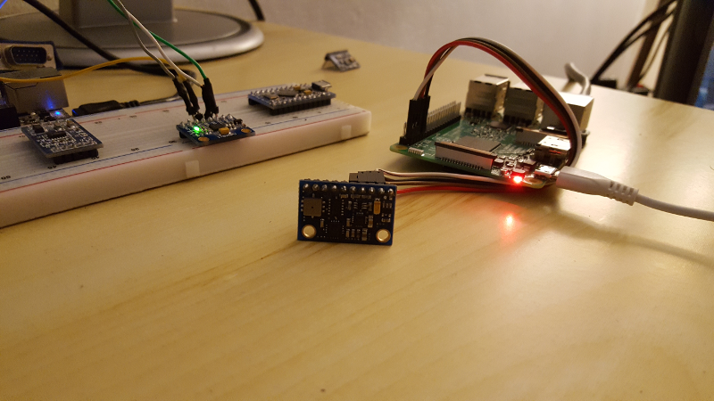

HMC5883L driver for Android Things
================================

This driver include 3-axis magnetometer. There is no warranty for this driver. NOT USE IN PRODUCTION!!

How to use the driver
---------------------

### Sample usage
Manual usage
```java
import com.cacaosd.android.things.contrib.driver.hmc5883l;

// Access the environmental sensor:

HMC5883L hmcl5883l;

try {
    hmcl5883l = new HMC5883L(i2cBusName);
    hmcl5883l.setSamplesAvarage(SAMPLES_AVARAGE_8);
    hmcl5883l.setOutputRate(OUTPUT_RATE_4);
    hmcl5883l.setMeasurementMode(MEASUREMENT_NORMAL);
    hmcl5883l.setMeasurementGain(GAIN_1090);
    hmcl5883l.setOperationMode(OPERATION_MODE_CONT);
} catch (IOException e) {
    // error.
}


try {
    float[] magnitudes = hmcl5883l.getMagnitudes();
} catch (IOException e) {
    // error reading
}

try {
    hmcl5883l.close();
} catch (IOException e) {
    // error closing sensor
}
```

You can register Android Sensor Service like this.
```java
SensorManager mSensorManager = getSystemService(Context.SENSOR_SERVICE);
SensorEventListener mListener = ...;
HMC5883LSensorDriver mSensorDriver;

mSensorManager = (SensorManager) getSystemService(Context.SENSOR_SERVICE);
        mSensorManager.registerDynamicSensorCallback(new SensorManager.DynamicSensorCallback() {
            @Override
            public void onDynamicSensorConnected(Sensor sensor) {
                if (sensor.getType() == Sensor.TYPE_MAGNETIC_FIELD) {
                    mSensorManager.registerListener(MagnetometerActivity.this,
                            sensor, SensorManager.SENSOR_DELAY_NORMAL);
                }
            }
        });

        try {
            mSensorDriver = new HMC5883LSensorDriver(BoardDefaults.getI2CPort());
            mSensorDriver.registerMagmetormeterSensor();

        } catch (IOException e) {
            Log.e(TAG, "Error configuring sensor", e);
        }
    }

if (mSensorDriver != null) {
    mSensorManager.unregisterListener(this);
    mSensorDriver.unregisterMagmetormeterSensor();
    try {
        mSensorDriver.close();
    } catch (IOException e) {
        Log.e(TAG, "Error closing sensor", e);
    } catch (Exception e) {
        e.printStackTrace();
    } finally {
        mSensorDriver = null;
    }
}
```


License
-------

      Copyright 2016 Cagdas Caglak

      Licensed under the Apache License, Version 2.0 (the "License");
      you may not use this file except in compliance with the License.
      You may obtain a copy of the License at

      http://www.apache.org/licenses/LICENSE-2.0

      Unless required by applicable law or agreed to in writing, software
      distributed under the License is distributed on an "AS IS" BASIS,
      WITHOUT WARRANTIES OR CONDITIONS OF ANY KIND, either express or implied.
      See the License for the specific language governing permissions and
      limitations under the License.
